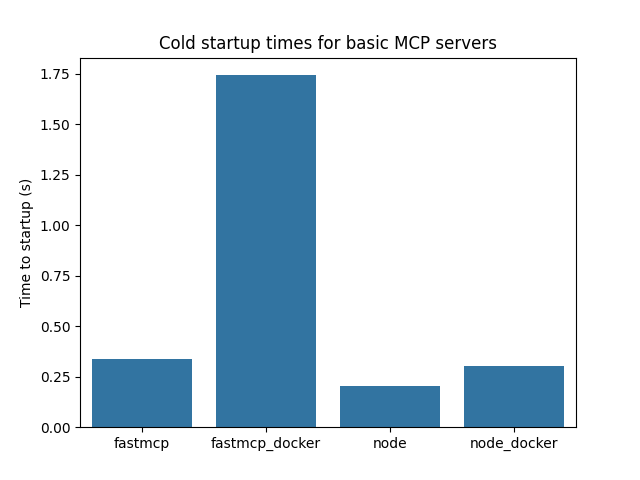
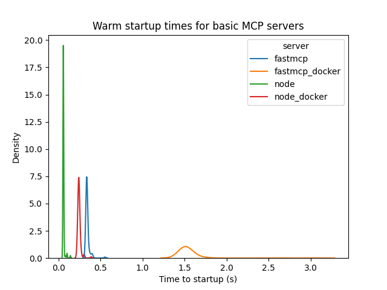
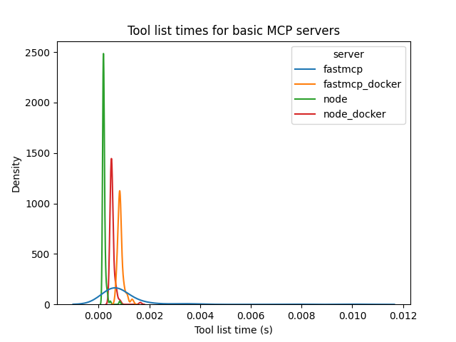
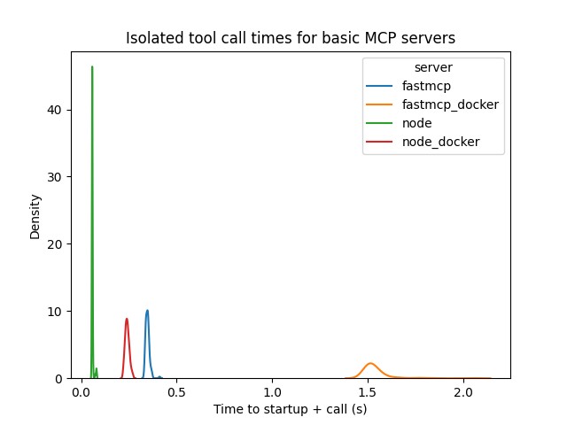
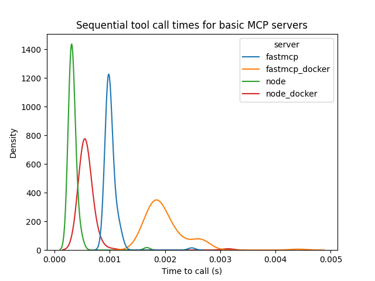
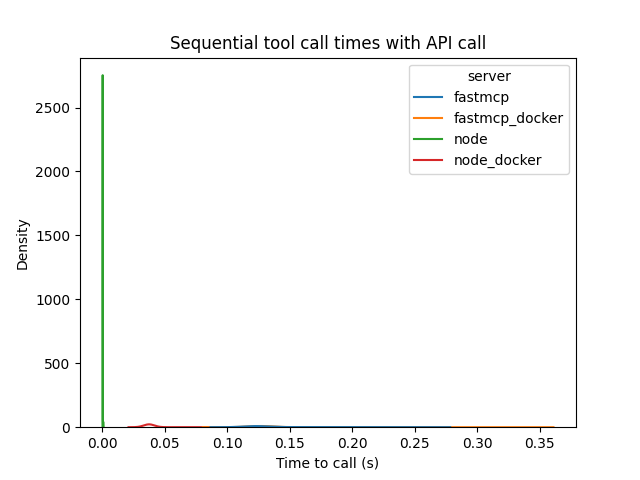

# MCP Performance Testing

The repo contains a test suite for some basic MCP servers.

## What is tested?

I am using four servers:

- The official Node MCP SDK
- The official Node MCP SDK - Dockerized
- FastMCP SDK
- FastMCP SDK - Dockerized

I have chosen these SDKs because I believe they are currently the most relevant in the ecosystem. FastMCP comes with many
additional features over the official Python MCP SDK. I did not include a test with just the official Python SDK because 
I have not seen new projects using it and it makes use of an older version of FastMCP itself for handling clients and servers.
I am not aware of an equivalent, popular JS SDK. 

**THE GOAL: Determine if any of these servers inherently presents a significant performance issue.**

## Methodology

These tests are all for STDIO transport. Although the rise of remote multi-user MCP servers are making STDIO less relevant,
this transport still has the greatest potential for performance issues. 

My basic Node server is found in `src/index.ts` and the equivalent FastMCP server is in `server.py`. I have attempted to
create efficient and minimal accompanying Docker files.

The tools defined in these servers are extremely basic and not representative of real-world tools. Again, mostly trying
to test the SDKs themselves. 

I am using FastMCP as the client in all benchmarks. I have set `keep_alive=False` in all transports so that no clients
are ever reused. 

I have five tests that are meant to cover multiple MCP use cases:

### Startup

This test measures the amount of time to connect a client to the server. Note that I have separated the first result
from each of the servers into a separate "cold start" chart.

### Tool listing

Open a client and request a tool list N times. Client is reused. 

### Isolated tool call

Open a client and call a tool N times. Client is NOT reused. 

### Sequential tool call

Open a client and call a tool N times. Client is reused. 

### API tool call

Open a client and call a tool that makes an API request. Client is reused.

## Results

### Startup

These cold startup times illustrate that Docker does incur a startup penalty. On other runs I have seen the jump for
Dockerized Node much higher and FastMCP much lower. My takeaways from this test are:

- FastMCP itself has a longer startup time than a very basic Node setup
- Dockerizing your servers may take you from sub-second to multi-second time scales for startup
- These results were for relatively optimal Docker files, you can make the startup time even worse with a suboptimal Docker file
- It is not uncommon to see community made servers that contain significant startup application code that causes a slowdown

Warm chart takeaways:

- Dockerizing made warm startup times less consistent for both SDKs
- Dockerizing about tripled warm startup time for both SDKs

### MCP Operations

Tool list time takeaways:

- There were some outliers in the non-Dockerized FastMCP server
- In all cases tool list operation was extremely quick, no (significant) differences in performance shown

This plot includes startup time and a basic tool call. This correlates with a use case where you are not reusing clients
and creating one per tool call. Takeaways:

- This plot is nearly identical to the warm startup plot above. Calling a simple tool is dwarfed by startup time in all cases

This plot represents the situation where you are repeatedly calling tools with the same client. Takeaways:

- This plot shows the stratification again of Node being slightly faster than FastMCP and Dockerization being a little slower. All of these basic tool call times are very quick though

This test was meant to add in a simple API call to make a slightly more realistic tool call and also account for any
differences in networking. This plot shows that for some reason the requests were practically instantaneous on Node,
don't know if that's suspect, but that we see similar separation as from above. Takeaways:

- It appears that the separation between the Dockerized and non-Dockerized servers is a little more pronounced in this graph, implying that Docker is having a little bit of a negative impact on network performance, but not too significant

# Conclusion

From the data I collected, you are not going to incur a significant *runtime* penalty for using any of these SDKs or
Docker. 

However, the startup times indicate that Docker may nearly triple your *startup* time, often taking you from sub-second
operations to multi-second. If you have a use case where you are frequently creating clients and you are performance
sensitive, you may need to avoid Docker or invest time optimizing your images. I have encountered several situations
with confusing performance penalties with Docker. 

If you need to have reproducible runs and are sensitive to startup performance, `npx` and `uvx` may be good places to
start looking at alternatives. 
